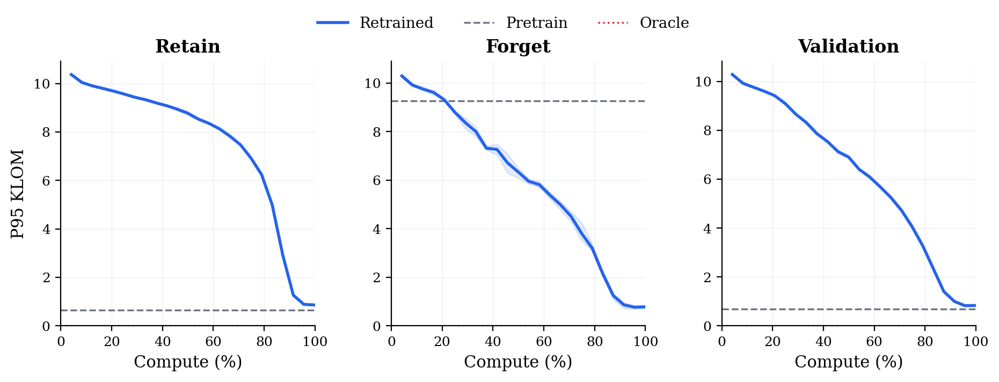

<p align="center">
  
</p>

<h1 align="center">EasyDUB</h1>

<p align="center">
  <a href="LICENSE"></a>
  <a href="https://www.python.org/">= 3.11"></a>
  <a href="https://huggingface.co/datasets/easydub/EasyDUB-dataset"></a>
  <a href="https://arxiv.org/abs/2602.16400"></a>
</p>

A minimal CIFAR-10 benchmark for evaluating data-unlearning methods using **KLOM** (KL-divergence of Margins). Ships with 200 pretrain models, 2,000 oracle models, and precomputed margins -- everything needed to score a new method in a few lines of code.

---

* [Getting Started](#getting-started)
* [KLOM Metric](#klom-metric)
* [Reproducing Compute vs KLOM](#reproducing-compute-vs-klom)
* [Citation](#citation)
* [License](#license)

## Getting Started

Evaluate pretrain models against the oracle baseline with a single command -- the dataset downloads automatically on first run:

```bash
git clone https://github.com/easydub/EasyDUB-code.git && cd EasyDUB-code
uv run python eval_pretrain.py --data-dir /path/to/EasyDUB-dataset --forget-set 2 --n-models 100
```

Expected output:

```
Split         P95 KLOM
------------------------
retain           0.3191
forget           9.2647
val              0.2639
```

A good unlearning method should bring the forget P95 KLOM down toward the oracle level, while keeping retain and val scores low.

## KLOM Metric

KLOM measures how close an unlearned model's per-sample margin distribution is to that of an oracle model retrained without the forget set.

The **margin** for a sample with logits $z$ and true label $c$ is:

$$m = z_c - \log \sum_{j \neq c} e^{z_j}$$

KLOM bins these margins across models and computes a per-sample KL divergence between the unlearned and oracle distributions. Lower is better.

## Reproducing Compute vs KLOM

<p align="center">
  
</p>

The figure shows how P95 KLOM evolves as retrained models see more of the retain set, compared to pretrain and oracle baselines.

Train the full grid (4 noise levels x 3 seeds, requires GPU) and generate the plot in one step:

```bash
uv run python reproduce.py --data-dir /path/to/EasyDUB-dataset
```

## Citation

If you use KLOM in your work, please cite:

```bibtex
@misc{georgiev2024attributetodeletemachineunlearningdatamodel,
  title         = {Attribute-to-Delete: Machine Unlearning via Datamodel Matching},
  author        = {Kristian Georgiev and Roy Rinberg and Sung Min Park and Shivam Garg and Andrew Ilyas and Aleksander Madry and Seth Neel},
  year          = {2024},
  eprint        = {2410.23232},
  archivePrefix = {arXiv},
  primaryClass  = {cs.LG},
  url           = {https://arxiv.org/abs/2410.23232},
}
```

If you use the EasyDUB benchmark, please also cite:

```bibtex
@misc{rinberg2026easydataunlearningbench,
      title={Easy Data Unlearning Bench},
      author={Roy Rinberg and Pol Puigdemont and Martin Pawelczyk and Volkan Cevher},
      year={2026},
      eprint={2602.16400},
      archivePrefix={arXiv},
      primaryClass={cs.LG},
      url={https://arxiv.org/abs/2602.16400},
}
```

## License

[MIT](LICENSE)
